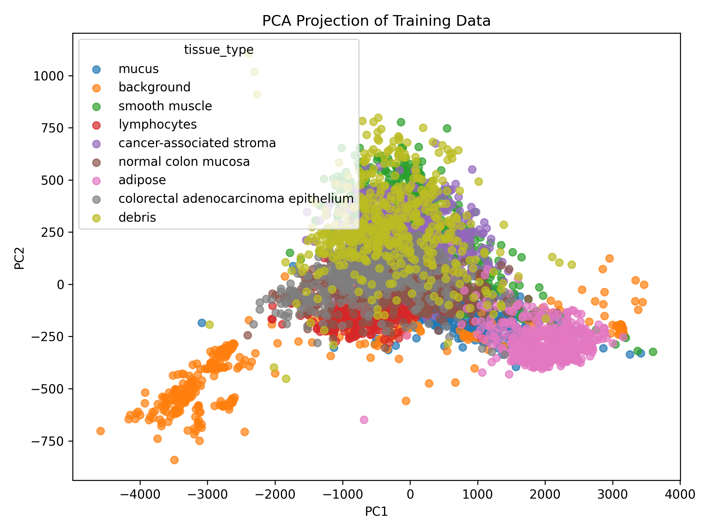
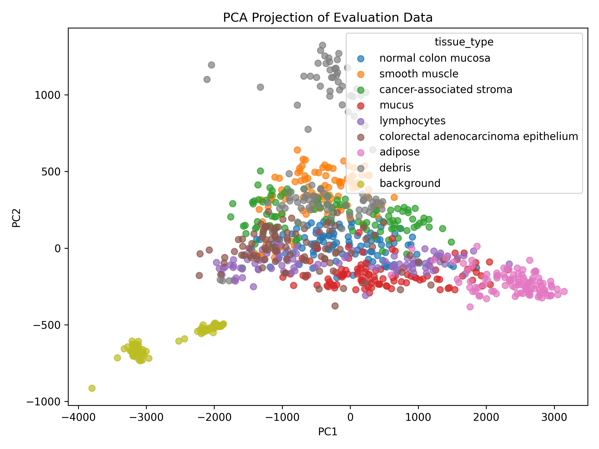
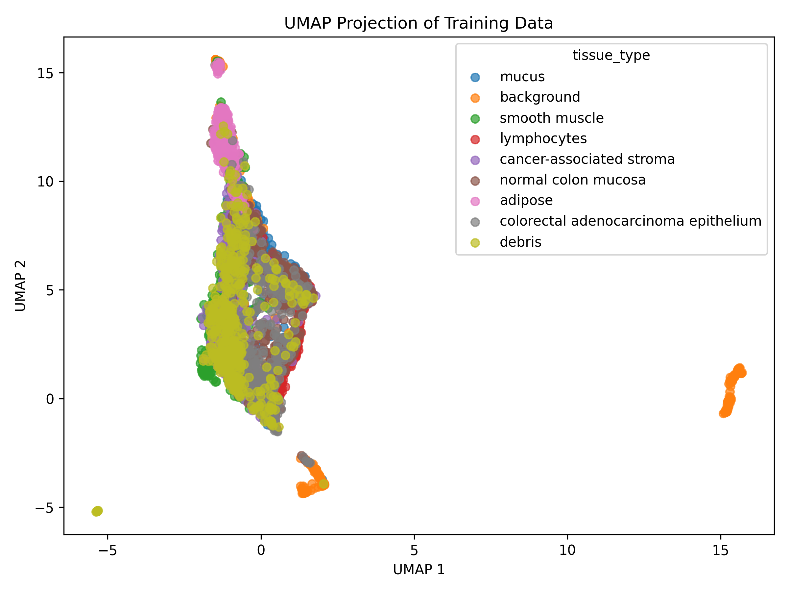
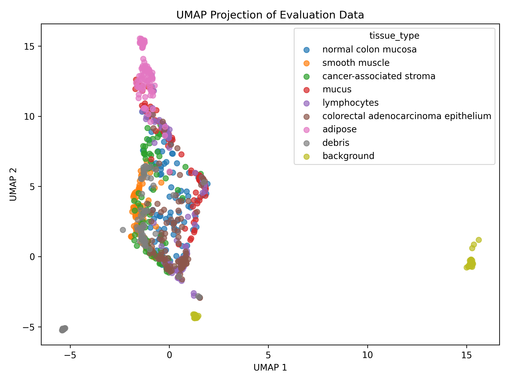
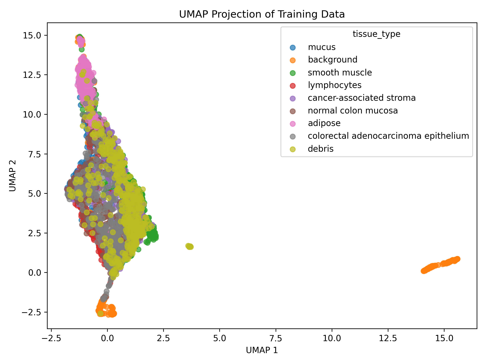
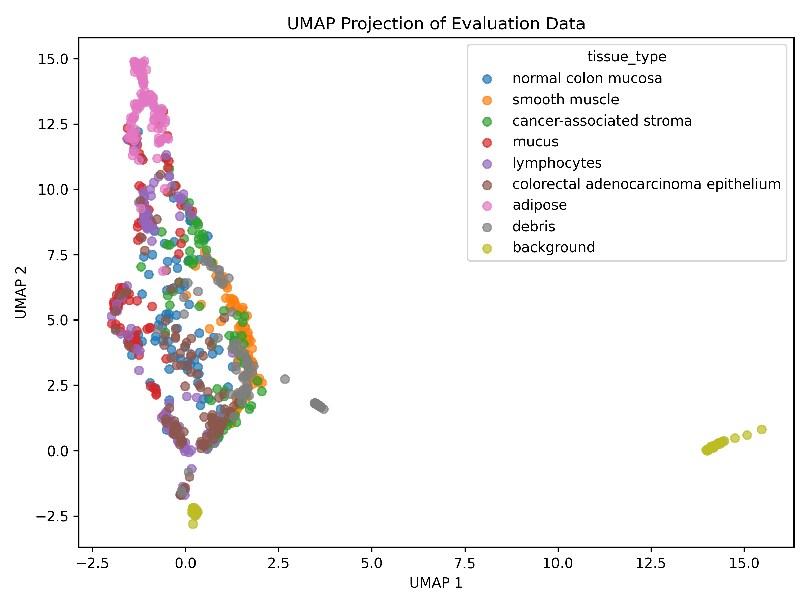

# Dataset 1: exploratory dimension-reduction analysis

PCA and UMAP reveal broad structure in the supplied image intensities, but neither produces a clean partition of the tissue labels. The first two principal components retain 57.01% of training variance; 161 components are needed for 90%. UMAP provides a complementary neighborhood view with broadly similar patterns in transformed evaluation images. Its small detached groups and gaps are partly sensitive to neighborhood size. Numerical warnings during PCA projection and trustworthiness calculation remain unresolved, so quantitative comparisons below are provisional.

## Data and preprocessing

The inputs were `data/dataset_1/train.csv`, `eval.csv`, `DATA.md`, and `schema.json`. Documentation identifies flattened 28 × 28 RGB PathMNIST histopathology images, with 4,500 training observations and 900 evaluation observations sampled from the original training and test splits, respectively. Documentation describes equal representation of nine tissue classes. The analysis tools confirm the observation counts and 2,352 numeric features. The schema excludes `sample_id` and `tissue_type` from all model inputs; tissue labels were used only for post-hoc plots and qualitative interpretation, never for fitting, settings, or quantitative evaluation.

The training [data profile](data_profile.json) reports:

| Characteristic | Observed value |
|---|---:|
| Numeric pixel features | 2,352 |
| Categorical input features | 0 |
| Missing feature values | 0 |
| Zero fraction | 0.000170446 (0.0170%) |
| Overall pixel range | 0–255 |
| Range of feature standard deviations | 30.9005–47.1394 |
| Image intensity total: minimum / median / maximum | 171,239 / 395,399 / 564,990 |

**Selected preprocessing: `none`, explicitly passed to every fit.** Pixels share a common intensity scale and their standard deviations do not differ by orders of magnitude. Preserving absolute intensity and channel variation is a reasonable starting point for exploration. Standardization would reweight individual pixels to equal variance without a demonstrated need. Log normalization is inappropriate here: these are image intensities, not counts whose totals measure sampling depth. Variation in image totals alone does not justify removing brightness differences. PCA still performs its intrinsic centering using the training mean.

This choice leaves brightness, color, staining, and spatial alignment able to influence pixel distances. Their individual contributions were not measured by the supplied tools. The inspection script profiles training data only; no separate evaluation profile was generated.

## Method choices and settings

PCA supplies a global linear baseline and quantifies variance retained. UMAP supplies a nonlinear local-neighborhood visualization without assuming that local image relationships are linear reconstructions or reliable geodesics. Both support applying a model fitted on training observations to evaluation observations. No independent evaluation fit was used.

| Analysis | Settings |
|---|---|
| PCA | All components computed internally; first two saved; no whitening requested; repository script defaults |
| Primary UMAP | 2 dimensions, 15 neighbors, minimum distance 0.1, Euclidean metric, random seed 123 |
| UMAP follow-up | 30 neighbors; all other explicit settings unchanged |
| Evaluation | Trustworthiness at 10 neighbors, separately within training and evaluation sets, relative to untransformed pixels |

UMAP's initial settings use the supplied defaults and target local exploration among 4,500 images. Euclidean distance matches the common pixel scale, while retaining the limitations of a raw-pixel representation. The follow-up was prompted by disconnected-looking groups in the completed primary embedding, not by tissue-label separation.

Other available methods were considered but not run:

- **Kernel PCA:** no specific kernel or bandwidth was justified by the documentation or inspection; UMAP already supplies the complementary nonlinear view.
- **MDS:** preserving every pairwise distance was not the primary objective; iterative pairwise optimization adds cost and the supplied implementation lacks evaluation transformation.
- **Isomap:** the data do not establish a manifold with meaningful graph-geodesic distances; global manifold geometry was not assumed.
- **LLE:** there was no evidence supporting local linear reconstruction of raw image vectors.
- **Laplacian Eigenmaps:** overlaps the neighborhood objective and lacks evaluation transformation in this workflow.
- **t-SNE:** also targets local visualization, but cannot transform evaluation images in the supplied workflow; UMAP addresses that objective with a shared train/evaluation representation.

## Quantitative findings

PCA explains **54.7984%** of training variance in PC1 and **2.2123%** in PC2, totaling **57.0107%**. Thus the display omits about 43% of variance, and PC1 dominates PC2. The **161 components** required for 90% variance show that a two-dimensional display is not a sufficient high-fidelity representation of these images. These percentages describe training variance, not evaluation variance. Full variance sequences are in [pca_metrics.json](pca_metrics.json).

| Two-dimensional representation | Training trustworthiness | Evaluation trustworthiness |
|---|---:|---:|
| PCA | 0.805881 | 0.847546 |
| UMAP, 15 neighbors | 0.814062 | 0.846841 |
| UMAP, 30 neighbors | 0.811855 | 0.847410 |

Values are rounded directly from [primary evaluation](embedding_evaluation.json) and [follow-up evaluation](followup_neighbors30/embedding_evaluation.json). All reference the same untransformed feature representation and the same evaluation neighborhood size. Labels do not enter these scores.

The reported scores suggest imperfect neighborhood preservation and no compelling numerical advantage for either method. UMAP's reported training improvement over PCA is small, while evaluation scores are nearly identical. Evaluation uses neighborhoods among the 900 evaluation observations, not evaluation-to-training neighbor retrieval. The higher evaluation scores therefore do not demonstrate superior generalization: sample density and the reference neighbor-ranking problem differ between splits. Trustworthiness does not establish global-distance fidelity, cluster validity, or tissue classification accuracy. Persistent numerical warnings further preclude using small score differences to rank methods confidently.

## Visual findings and targeted follow-up

The plots were inspected for both splits and both UMAP settings. **Read each plot's legend:** the supplied plotting function assigns colors by first label occurrence, so tissue colors differ between training and evaluation plots. Legends also obscure some points, and overplotting limits fine interpretation.

In PCA, training observations form a broad central cloud with substantial tissue overlap. Many background-labeled observations occupy a lower-left extension, while adipose-labeled observations concentrate toward positive PC1 and negative PC2. Debris, smooth muscle, and stroma overlap in the upper central region; other tissue annotations overlap extensively around the center and lower region. Evaluation observations reproduce broad background and adipose patterns, but some debris observations extend farther upward along PC2. This is a qualitative difference, not a formal distribution-shift test. No PC loading or image-reconstruction analysis was available in the supplied outputs, so PC1 cannot be identified definitively as brightness or a biological factor.

Primary UMAP shows an elongated, curved main structure with substantial label mixing, a prominent distant background-dominated group, another lower background-dominated group, and smaller detached patches. Adipose-labeled observations concentrate toward an end of the main structure. Evaluation images transformed through the training model occupy corresponding broad regions. Agreement is descriptive and does not establish distinct populations or a trajectory.

Increasing the neighborhood size from 15 to 30 retains the broad main structure, distant background-dominated group, and adipose concentration. However, the lower group becomes more connected-looking and small detached patches change position. Reported trustworthiness changes little. Consequently, broad patterns recur under this one perturbation, while exact gaps, island positions, and apparent connectivity should not be treated as established features. No cross-seed stability, coordinate alignment, or cluster-membership stability was quantified. UMAP inter-group distances are not reliable measurements of global image dissimilarity.

## Warnings, limitations, and execution record

All computational analyses used the supplied repository scripts through `.venv/bin/python3`; no new analysis scripts, package installations, or input modifications were made. The data-inspection, preprocessing, PCA, UMAP, and embedding-evaluation skills guided the workflow; alternative-method skills informed exclusions.

Initial PCA and UMAP processes exited with code 134 before completing plots. Rerunning the same analyses with `MPLBACKEND=Agg`, `VECLIB_MAXIMUM_THREADS=1`, and `OPENBLAS_NUM_THREADS=1` completed successfully and produced the retained primary artifacts. These settings were also used for subsequent evaluation and follow-up. The successful noninteractive reruns resolve output generation, but do not prove the exact cause of the original exits.

PCA evaluation projection continued to emit divide-by-zero, overflow, and invalid-value warnings in matrix multiplication. Trustworthiness computation emitted the same warning categories. Rerunning the supplied tools with the thread limits did not eliminate them; repeated primary evaluation returned the same reported scores. Saved two-dimensional coordinates were accepted by the evaluator and plots were produced, but this is not an independent numerical correctness check. The underlying warning cause remains undiagnosed within the supplied-tool constraint. **Treat PCA projection and trustworthiness comparisons as provisional pending numerical-library investigation.** No warning was silently suppressed, and no alternative calculation was implemented.

Matplotlib used temporary caches because its default cache directory was unwritable; this affected execution setup, not an analysis setting. UMAP warned that fixing the random seed enforces single-job execution; the seed was retained for reproducibility. An initial aborted UMAP process also reported a leaked semaphore at shutdown; the noninteractive rerun completed.

Further limits are substantive: flattened pixels do not explicitly encode tissue morphology or spatial invariance; the balanced subset does not estimate real-world class prevalence; labels provide only post-hoc context; and no clustering, diagnostic prediction, clinical inference, or formal distribution-shift test was performed. The supplied tools do not provide image montages, PCA loading maps, or independent numerical-backend validation, so those analyses were not added.

## Saved outputs and interpretation

The output directory contains the training profile; PCA and primary UMAP train/evaluation coordinate CSVs, metric JSONs, and PNGs; and the primary evaluation JSON. The `followup_neighbors30/` subdirectory contains the analogous UMAP follow-up artifacts and its separate evaluation JSON. Coordinate CSV rows retain input order; the supplied exporter does not include sample identifiers. Settings are recorded in each method's metrics JSON. PCA retains only two-dimensional coordinates, although its metrics contain all explained-variance ratios; fitted model objects are not exported by these scripts.

Use PCA to describe the dominant linear variation and UMAP to inspect complementary local relationships. Both support broad, partially label-associated structure with extensive overlap. Neither establishes nine distinct clusters, reliable biological distances, or a sufficient two-dimensional summary of histopathology. The neighborhood sensitivity and unresolved numerical warnings limit finer conclusions.
