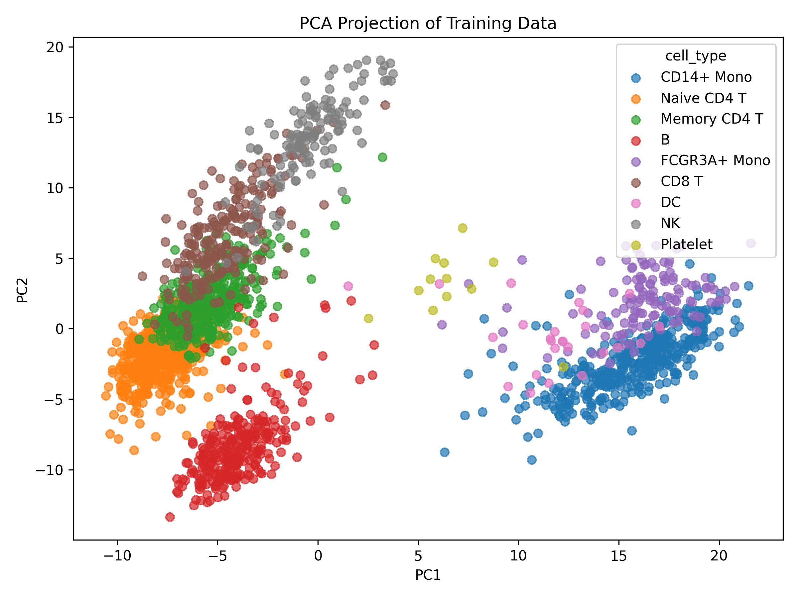
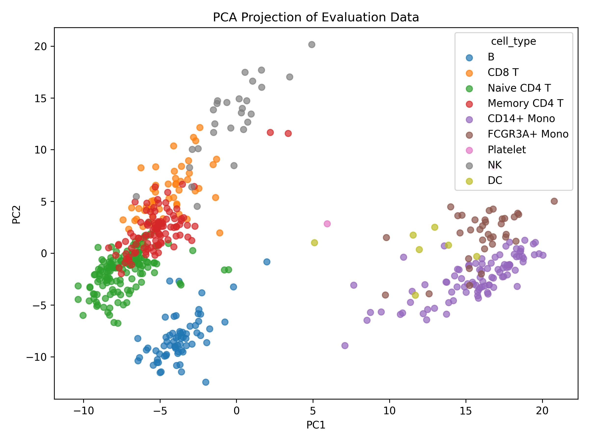
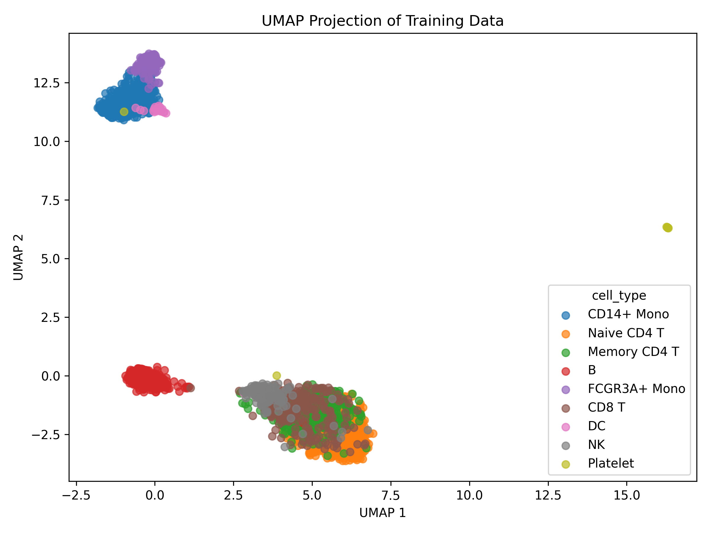
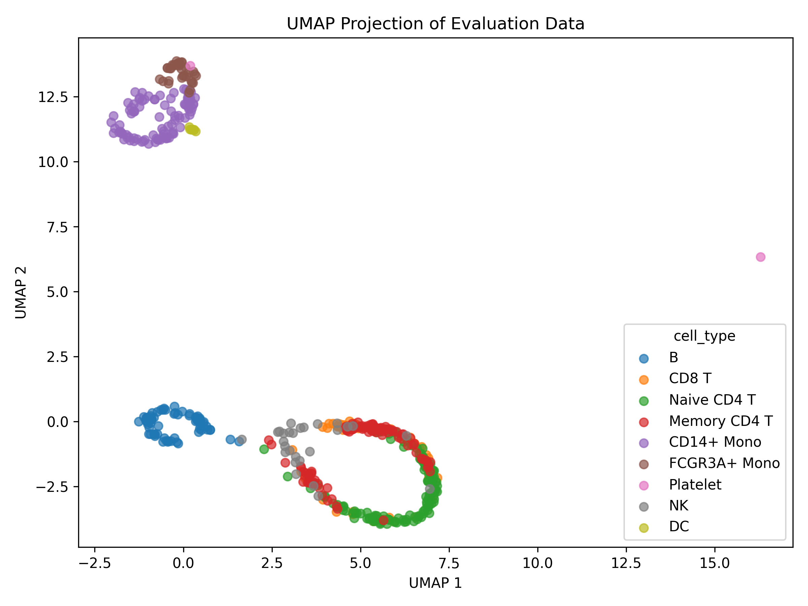
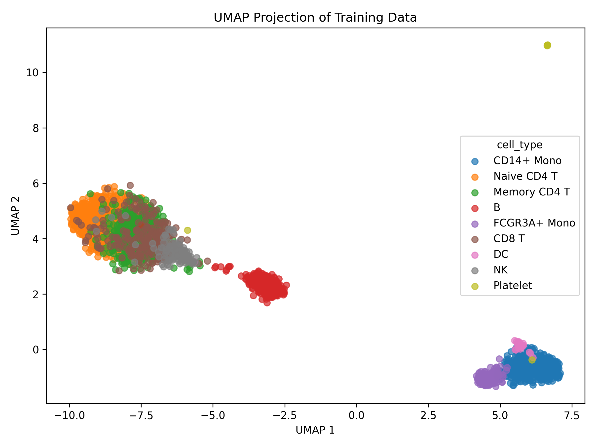
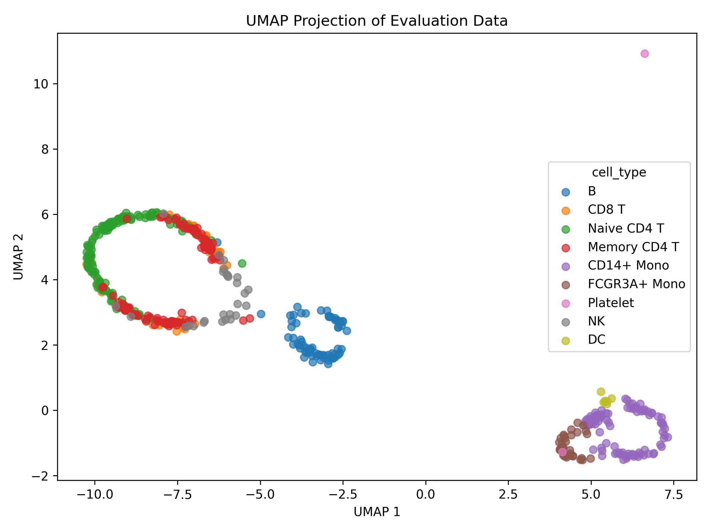

# Dataset 2: exploratory dimension-reduction analysis

## Findings

Log-normalized PCA and UMAP show broad expression structure that is qualitatively associated with the supplied cell-type annotations. PCA provides an interpretable linear baseline, but its first two components explain only **10.1154%** of training variation. UMAP emphasizes separated groups without improving the reported local-neighborhood preservation over PCA. Held-out UMAP cells form conspicuous peripheral rings rather than reproducing training densities, including in a targeted neighborhood sensitivity run. These are exploratory representations, not evidence establishing clusters, trajectories, or new cell identities.

**Numerical qualification:** matrix-multiplication warnings persisted in PCA transformation and trustworthiness evaluation. The tools completed and produced usable coordinates and finite scores, but the warning cause remains unresolved. Quantitative comparisons should therefore be considered provisional, particularly small differences between methods.

## Data and inspection

Input: `data/dataset_2`. All analysis outputs are in `outputs/final_dataset_2`. Decisions used `DATA.md`, `schema.json`, the repository skills, and the generated `data_profile.json`.

The documentation describes 2,638 annotated PBMC3K cells, split into 2,110 training and 528 evaluation cells with split seed 123. Of the original 2,700 cells, 62 without matched annotations were excluded. Genes detected in at least three training cells were candidates; the 2,000 highest raw-count-variance genes were selected using training observations only. Thus these results concern an annotation-selected cell subset and a preselected gene representation, not the full original expression matrix.

The supplied inspection tool profiles training data only:

| Characteristic | Observed value |
|---|---:|
| Training cells | 2,110 |
| Numeric gene features | 2,000 |
| Categorical input features | 0 |
| Missing feature values | 0 |
| Zero feature values | 3,123,001 (74.0048%) |
| Selected-gene counts per cell: minimum / median / maximum | 376 / 1,873.5 / 7,146 |
| Mean selected-gene counts per cell | 2,014.8635 |

Feature magnitudes also differ substantially: FTL has mean 28.0773 and standard deviation 45.4300, whereas NCBP2-AS2 has mean 0.1403 and standard deviation 0.5228. Documentation identifies these as raw counts, and the profile confirms nonnegative training values and positive training row totals.

`sample_id` was excluded as an identifier and `cell_type` as a label. Labels were used only by the plotting tools and for post-hoc qualitative interpretation; they were excluded from preprocessing, fitting, parameter selection, and quantitative evaluation.

## Preprocessing and methods

Every run explicitly used `--preprocessing log_normalize`: divide each cell's counts by its selected-gene total, multiply by 10,000, and apply `log(1+x)`. The approximately 19-fold variation in row totals, count measurement scale, and large feature-magnitude differences support this choice. Raw counts would retain strong total-count effects; standardization alone would not normalize per-cell totals or compress large counts. No additional gene standardization or imputation was applied.

Normalization is cell-wise with a fixed target, so it estimates no cross-cell parameters from evaluation data. Its denominator uses only the 2,000 supplied genes, not full-transcriptome library size. It therefore measures relative expression within this subset and does not remove all technical variation or distinguish technical depth from biological RNA-content differences.

| Method | Rationale and settings |
|---|---|
| PCA | Global linear variance baseline. The supplied script fits all available components on training data, centers features, and saves PC1–PC2. Evaluation cells use the fitted training transformation. No randomized setting is exposed by this script. |
| UMAP | Complementary nonlinear neighborhood visualization with out-of-sample transformation. Two dimensions, 15 neighbors, minimum distance 0.1, Euclidean distance, random seed 123. Applied directly to all 2,000 log-normalized features. |
| UMAP follow-up | Increased neighbors to 30, keeping all other settings fixed, to assess sensitivity of separated groups and the unusual held-out peripheral geometry. Saved separately in `followup_umap_30`. |

The initial UMAP defaults were a reasonable local scale for 2,110 observations. Euclidean distance also matches the evaluation reference metric. The follow-up doubled the neighborhood size without searching for label separation. Models were fitted only on training data; evaluation embeddings were transformations, not independent fits.

Other available methods were considered but not run:

- **Kernel PCA:** no specific kernel similarity or bandwidth was justified; UMAP already supplied a nonlinear view.
- **MDS:** preservation of all pairwise distances was not the primary objective, and the supplied implementation lacks evaluation transformation.
- **Isomap:** no evidence supported a reliable connected manifold with meaningful geodesic distances for this sparse count representation.
- **LLE:** a locally linear reconstruction assumption was not established.
- **Laplacian Eigenmaps:** overlaps the local-graph objective of UMAP but lacks evaluation transformation here.
- **t-SNE:** a reasonable local visualization alternative, but UMAP meets that objective while supporting the held-out split.

## Quantitative evaluation

The repository evaluator assessed only generated embeddings, using **10-neighbor trustworthiness** against the same log-normalized 2,000-feature representation. Labels were not involved. Training and evaluation scores were computed separately within each split; evaluation trustworthiness does not measure evaluation-to-training neighbor accuracy. Scores are rank-based neighborhood measures, not percentages of correctly classified cells or fractions of variance retained.

| Representation | Training trustworthiness | Evaluation trustworthiness |
|---|---:|---:|
| PCA, PC1–PC2 | 0.789107 | 0.789162 |
| UMAP, 15 neighbors | 0.781270 | 0.779197 |
| UMAP, 30 neighbors | 0.782993 | 0.781734 |

PCA explains 7.4617% in PC1 and 2.6537% in PC2, totaling 10.1154%; **873 components** are required to reach 90% of training variance. Thus broad visible separation coexists with substantial variation outside the two-dimensional plot. The 873-component result does not establish biological intrinsic dimension because expression noise also contributes variance.

PCA has slightly higher reported trustworthiness, while UMAP's broader neighborhood changes scores only modestly. Neither method preserves neighborhoods nearly perfectly. Similar training/evaluation scores are encouraging within this split but do not establish external generalization. No uncertainty intervals or significance tests are provided by these tools, and the numerical warnings further limit ranking interpretations.

## Visual findings

All six generated plots were inspected. **Colors change between training and evaluation plots** because the supplied plotting function assigns colors in label encounter order; compare legend names rather than matching colors. Plot axes are also independently scaled.

PCA shows a broad positive-PC1 region containing most annotated monocytes, with FCGR3A+ Mono tending toward higher PC2 than CD14+ Mono. B annotations occupy a lower-PC2 region. Naive CD4 T, Memory CD4 T, CD8 T, and NK annotations occupy overlapping portions of an extended region, with NK tending toward its high-PC2 end. The evaluation plot broadly reproduces these patterns. Sparse DC and Platelet annotations do not justify confident subgroup conclusions.

At 15 neighbors, UMAP shows a monocyte/DC-rich group, a B-rich group, and a larger overlapping T/NK-rich region. Some Platelet annotations occupy a distant compact location, while others lie near larger groups. Apparent compactness and empty space should not be interpreted as biological homogeneity or quantitative between-group distances.

Held-out observations map to broadly corresponding regions but trace rings or edges around dense training groups. This discrepancy limits interpretation of held-out density, holes, and fine local arrangement; the display does not support a biological cycle. Its cause cannot be established from the supplied outputs.

With 30 neighbors, the broad annotation-associated grouping remains, but relative placement and spacing change substantially. The peripheral held-out pattern persists. This supports retaining only broad qualitative observations across these two settings, not fixed global geometry or stable fine substructure. Only one seed and one alternative neighborhood size were investigated.

## Warnings, limitations, and reproducibility

Initial PCA and UMAP attempts wrote coordinates but terminated with exit code 134 before producing figures. Rerunning the same supplied scripts with `MPLBACKEND=Agg` completed successfully. Final runs also set `VECLIB_MAXIMUM_THREADS=1` and `OPENBLAS_NUM_THREADS=1`; these did **not** eliminate matrix-multiplication divide-by-zero, overflow, and invalid-value warnings in PCA evaluation transformation and the evaluator's distance computations. The baseline evaluator was rerun after final embeddings were saved and returned identical scores.

Investigation included reviewing preprocessing and transformation code, inspecting the plots, and checking the saved baseline coordinate files for blank/NaN/Inf fields and expected row counts (2,110 training and 528 evaluation). No such malformed coordinate fields were found, and evaluation completed rather than rejecting nonfinite input. These observations do not establish that intermediate distance calculations were unaffected. No warnings were suppressed, and no alternative numerical implementation was introduced under the repository's supplied-tools-only constraint.

Matplotlib used temporary font caches because its default cache directory was unwritable. UMAP warned that a fixed seed forces single-job execution; this is a reproducibility/performance notice. An initial aborted process also reported a leaked semaphore at shutdown. These operational notices are distinct from the unresolved numerical warnings.

The inspection tool does not generate a separate evaluation-data profile. Supplied tools also do not provide marker-gene validation, batch-effect or cell-quality diagnostics, PCA loadings reports, or quantitative train-to-evaluation mapping diagnostics. None were added. The supplied annotations are contextual labels, not independent biological validation. Feature selection by raw-count variance may emphasize abundant genes; that selection was retained as documented.

All computation used `.venv/bin/python3` and the supplied inspection, PCA, UMAP, and embedding-evaluation scripts. No packages were installed and input data were not modified. Metrics JSON files retain preprocessing and important method settings. Embedding CSVs contain coordinates in source row order, without identifiers; join them to the corresponding input by row order if needed.

The output directory contains `data_profile.json`, PCA and UMAP metrics, training/evaluation coordinate CSVs and PNGs, and `embedding_evaluation.json`. The follow-up directory contains the corresponding UMAP files and its own evaluation JSON. These outputs support using PCA for a qualified variance summary and UMAP for broad exploratory grouping, while retaining explicit uncertainty about numerical diagnostics and held-out UMAP geometry.
